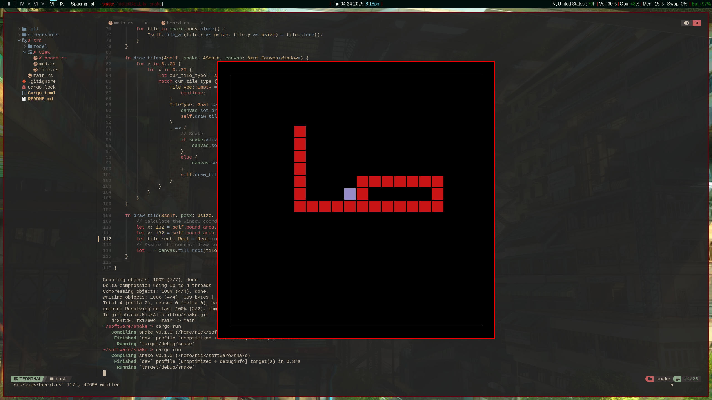
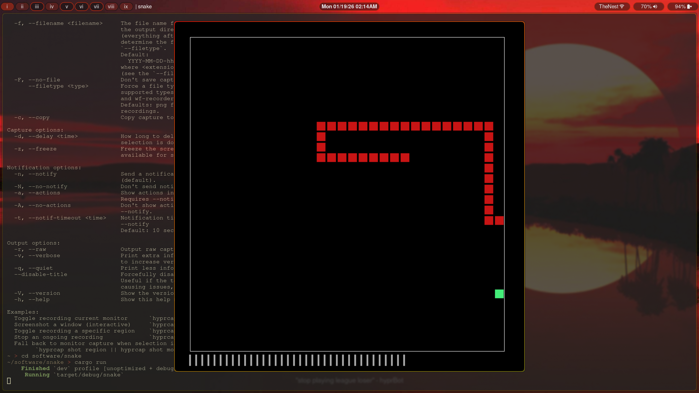
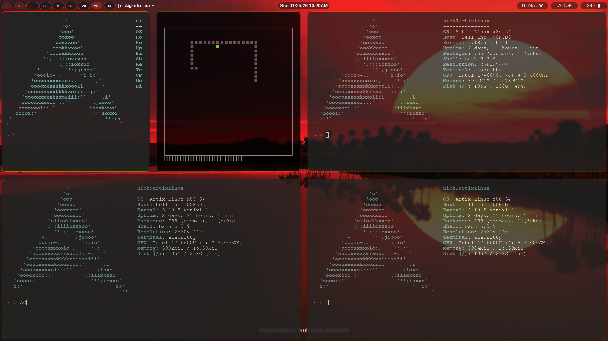

# snake - Rust

My own artistic take on the classic snake game.
This is a very simple game project to practice using rust and give my laptop a classic game to play.

Goal switches to a random color every frame similar to the super mario star power-up in feel. Snake is pinkish with a grey head.
I think, in the future, I will make the snake move from green to more red through interpolation or something simpler. 
Pause, restart, and quit hot-keys implemented. Score shown as tallies around the edge of the snake's world box. Every time
a goal is collected the snake speeds up by 1%.

## Current look

## Keybinds
Traditional arrow navigation or VIM motions
-  and **H** for left
-  and **L** for right 
-  and **K** for up 
-  and **J** for down
Pause/Play with **P**.
Restart the game with **R**.
Quit the app with **Q**.

## Resizable 
Resizable by user, window manager, or operating system to any reasonable degree as seen in the screenshot below.

