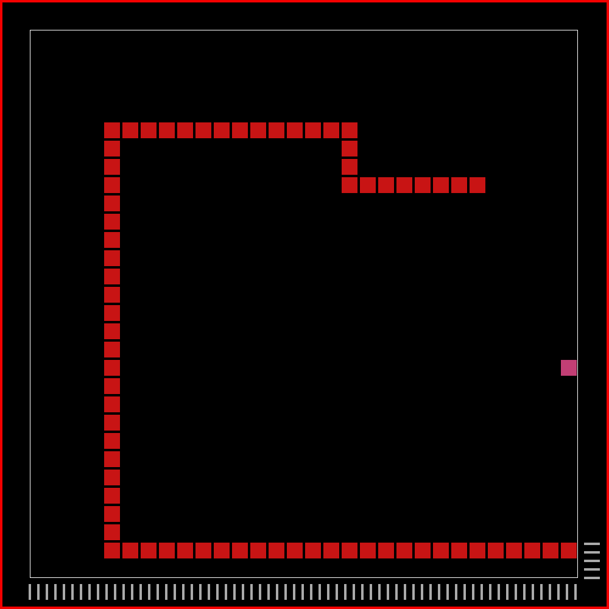

# snake - Rust

My own artistic take on the classic snake game.
This is a very simple game project to practice using rust and give my laptop a classic game to play.

Goal switches to a random color every frame similar to the super mario star power-up in feel. Snake is green with a grey head.
Pause, restart, and quit hot-keys implemented. Score shown as tallies at the bottom of the screen.

## Current look

